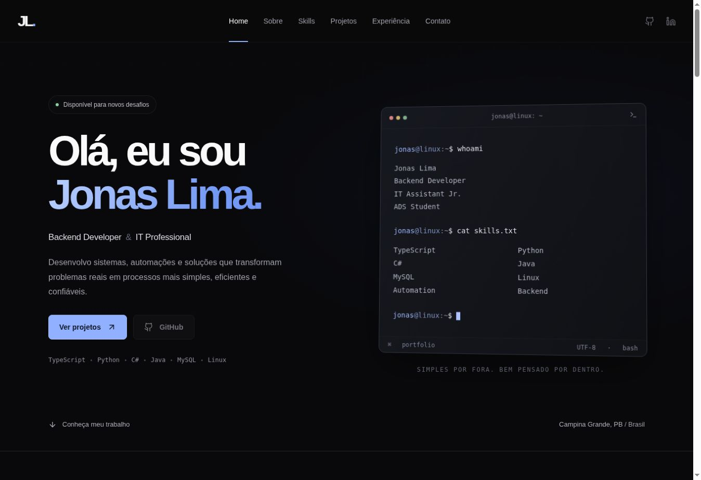

# Jonas Lima — Portfolio


Portfólio de Jonas Lima, Backend Developer, Assistente de T.I. Júnior e estudante de Análise e Desenvolvimento de Sistemas. Interface dark, responsiva, inspirada em ferramentas de desenvolvimento e Linux.

## Tecnologias

React, TypeScript, Vite, Tailwind CSS, Lucide React e Framer Motion. Aplicação estática, sem servidor de aplicação, credenciais ou banco de dados.

## Instalação e execução

Requisito: Node.js 22 ou superior, com npm.

```bash
npm install
npm run dev
```

Abra o endereço exibido no terminal. Para gerar e conferir a versão de produção:

```bash
npm run build
npm run preview
```

O build verifica o TypeScript e gera os arquivos estáticos em `dist/`.

## Personalização obrigatória antes de publicar

Edite `src/data/profile.ts` com seu usuário real do GitHub, URL pública do LinkedIn e email profissional. Não coloque senhas ou tokens: tudo no frontend é público.

```ts
export const profile = {
  githubUsername: '',
  linkedinUrl: '',
  email: '',
  githubApiEnabled: false,
};
```

Enquanto os campos estiverem vazios, os links correspondentes não serão clicáveis e o contato exibirá “Canais de contato em breve”. Não há links fictícios. O botão de contato usa email, ou LinkedIn quando o email não estiver preenchido.

Em `src/data/projects.ts`, preencha `github` e `url` de cada projeto apenas quando existir um endereço público. “Ver projeto” abre detalhes acessíveis no próprio portfólio, inclusive quando o projeto é privado. Os status iniciais são descritivos (“Projeto interno”); ajuste-os conforme a situação real. A janela do NexIT é uma representação conceitual, identificada na página.

Skills e experiência ficam em `src/data/skills.ts` e `src/data/experience.ts`. Não foram inventadas datas ou métricas profissionais.

## Integração opcional com GitHub

Após informar `githubUsername`, defina `githubApiEnabled: true` para carregar a quantidade de repositórios públicos, três projetos recentes próprios e as linguagens mais frequentes nos até 100 repositórios mais recentes. A contagem pública pode incluir forks; a lista e a análise de linguagens excluem forks. Nenhuma API key é exigida. A API pública possui limites; falhas de rede e de limite exibem uma mensagem sem bloquear o restante da página.

## Publicação no GitHub Pages

1. Crie um repositório no seu GitHub e envie **o conteúdo desta pasta**, incluindo `.github/`, para a raiz do repositório, na branch `main`.
2. Em **Settings → Pages → Build and deployment → Source**, selecione **GitHub Actions**.
3. Faça um push para `main` ou execute manualmente o workflow **Deploy portfolio to GitHub Pages**, na aba Actions.
4. Após o job de deploy terminar, o endereço estará disponível no ambiente `github-pages` e em Settings → Pages.

O workflow `.github/workflows/deploy.yml` configura o caminho base a partir de `actions/configure-pages`, atendendo tanto repositórios de projeto (`/nome-do-repositorio/`) quanto sites de usuário e domínios próprios (`/`). Não precisa editar o código para trocar o nome do repositório. Se a branch principal tiver outro nome, ajuste `on.push.branches`.

Para compilar manualmente para uma subpasta no Linux/macOS:

```bash
VITE_BASE_PATH=/nome-do-repositorio/ npm run build
```

No PowerShell:

```powershell
$env:VITE_BASE_PATH='/nome-do-repositorio/'
npm run build
```

Não envie `node_modules/` ao GitHub. O workflow publica somente `dist/`. A publicação precisa ser feita na conta do proprietário; este pacote não cria repositório nem publica automaticamente por fora do workflow.

Referências: [Deploy estático do Vite](https://vite.dev/guide/static-deploy.html#github-pages) e [configuração oficial do GitHub Pages](https://github.com/actions/configure-pages).

## Estrutura

- `src/components/`: navegação, hero, terminal, seções, cards e detalhes.
- `src/data/`: informações públicas configuráveis.
- `src/App.tsx`: composição da página.
- `src/index.css`: tema, layout responsivo, estados de foco e estilos.
- `public/favicon.svg`: identidade JL.
- `index.html`: idioma, SEO e Open Graph.
- `.github/workflows/deploy.yml`: build e deploy.

## Acessibilidade e desempenho

HTML semântico, link de salto ao conteúdo, foco visível, identificação da seção atual, diálogo nativo com Escape e retorno de foco, menu mobile com estado expandido e suporte a `prefers-reduced-motion`. Ícones são importados individualmente; não há fontes remotas ou imagens pesadas. Metadados Open Graph de texto estão incluídos; nenhuma imagem de compartilhamento fictícia foi adicionada.

A pontuação do Lighthouse deve ser medida na URL publicada; não há pontuação estimada ou prometida.

## Screenshots



Captura real da aplicação. Build de produção e verificação TypeScript concluídos. Navegação e diálogos de projeto conferidos no navegador desktop. Layout mobile implementado com media queries; não houve emulação mobile nem medição de Lighthouse nesta entrega.

## Licença

Código disponível sob licença MIT, em `LICENSE`. Textos, identidade e projetos representam Jonas Lima; personalize-os ao reutilizar o código.
